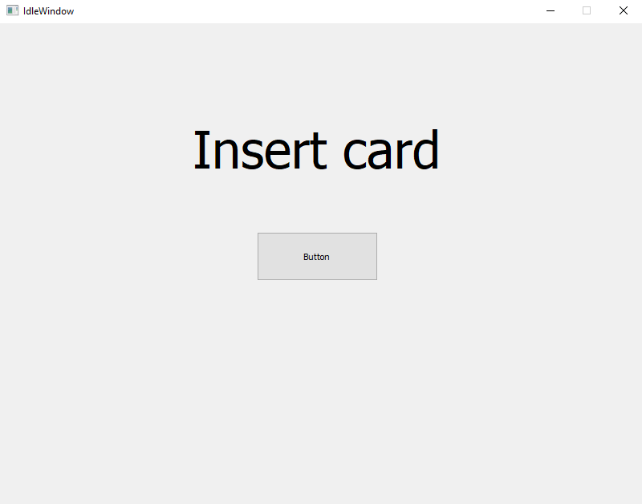
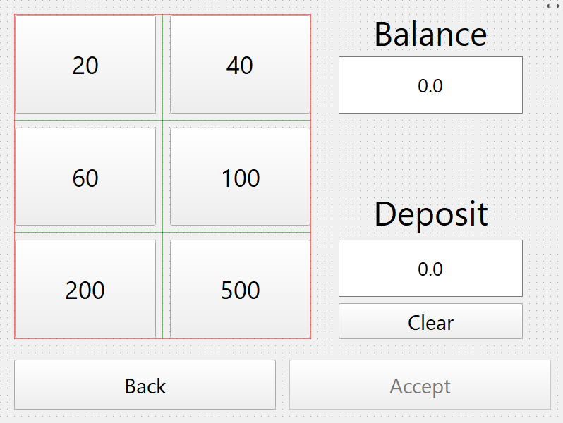

# Ryhmän 2 pankkiautomaatti projekti

Pankkiautomaatilla voi nostaa ja tallettaa rahaa sekä katsella tilitietoja. Web käyttöliittymässä voi katsella ja päivittää omia tietoja, luoda uuden tilin ja liittää kyseiseen tiliin uuden pankki- tai luottokortin sekä avata lukkiintuneen tilin.

Automaatin käyttöliittymä on toteutettu C++:lla ja Qt5 frameworkillä. Backend on toteutettu Node.js:llä ja Express.js frameworkillä. Frontend on toteutettu Vue.js:llä. Tietokantana on käytetty MySQL.

---

## Demo
[](https://youtu.be/1W5UKCmNBEo)

---

## Asennusohje

### .env
Luo backend kansioon tiedosto nimeltään .env ja kirjoita sinne seuraavat muuttujat
```
DB_USER=root
DB_PASS=root
DB_HOST=localhost
DB_DB=banksim
SECRET_TOKEN=secret_token
```
Backend:
```
cd ./web/backend
npm install
npm start
```
Frontend:
```
cd ./web/frontend
npm install
vue serve
```

---
## Tietokanta
Importtaa banksim.sql omaan tietokantaan komennolla:
```
mysql -u <user> -p < banksim.sql
```

## ER-kaavio


---
## Muutamia Kuvia






